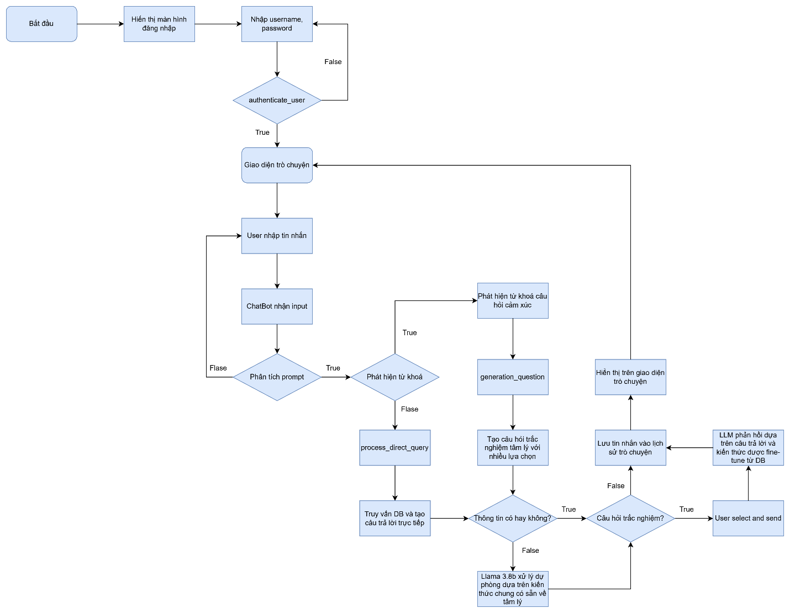
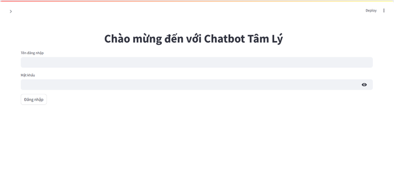
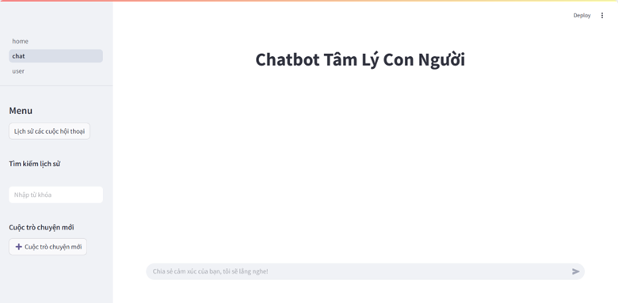
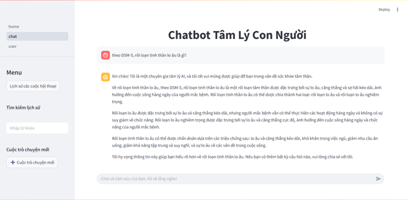
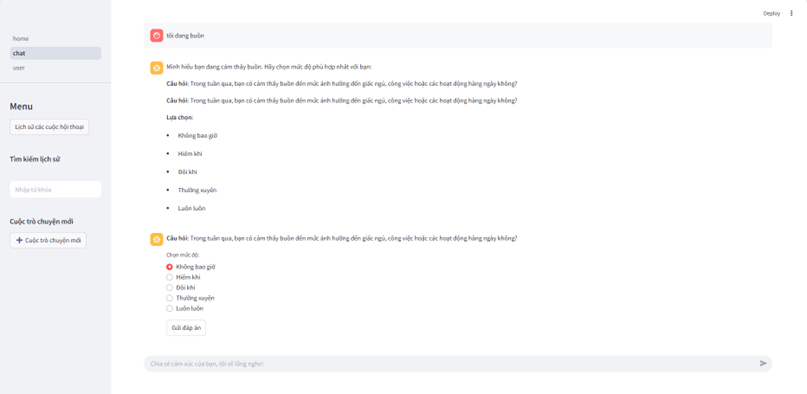
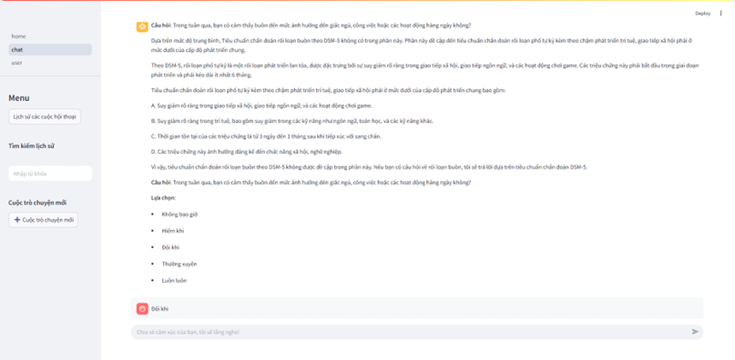

## 📘 Hệ thống Chatbot Tâm Lý Thông Minh với DSM-5

> **Dự án**: Chatbot tư vấn sức khỏe tâm thần sử dụng AI, xây dựng trên cơ sở dữ liệu DSM-5 (Diagnostic and Statistical Manual of Mental Disorders). Hệ thống kết hợp RAG (Retrieval-Augmented Generation), phân tích cảm xúc, và LLM để cung cấp câu trả lời chính xác và cá nhân hóa cho người dùng.

---

## 🧑‍💻 THÔNG TIN CÁ NHÂN

| Họ và Tên | [Tên của bạn] |
|-----------|---------------|
| **Vị trí ứng tuyển** | NodeJS Intern/Fresher |
| **Dự án** | Mental Health Chatbot with AI |
| **Thời gian thực hiện** | [Thời gian] |
| **Vai trò** | Full-stack Developer |
| **Công nghệ** | Python, LangChain, FAISS, Streamlit, Groq API, RAG Architecture |

---

## 🧠 MÔ TẢ HỆ THỐNG

Hệ thống Chatbot Tâm Lý là một ứng dụng web AI giúp người dùng:
- **Truy vấn trực tiếp**: Tìm kiếm thông tin về các rối loạn tâm lý, tiêu chuẩn chẩn đoán DSM-5, triệu chứng, và phương pháp điều trị
- **Phân tích cảm xúc**: Nhận diện cảm xúc người dùng thông qua từ khóa và ngữ cảnh
- **Đánh giá tương tác**: Sinh câu hỏi trắc nghiệm để đánh giá mức độ cảm xúc và đưa ra gợi ý phù hợp
- **Tra cứu thông minh**: Sử dụng Vector Database (FAISS) để tìm kiếm ngữ nghĩa chính xác trong tài liệu DSM-5

### Kiến trúc hệ thống:
```
User (Browser) <--> Streamlit UI <--> Bot Logic <--> Conversation Engine
                                                      ├── LLM (Groq API)
                                                      ├── Vector DB (FAISS)
                                                      └── Keyword Analysis
```

### Sơ đồ luồng hoạt động:



**Giải thích luồng hoạt động:**
1. **Đăng nhập**: Người dùng nhập username/password → Xác thực
2. **Giao diện trò chuyện**: Sau khi đăng nhập thành công, hiển thị giao diện chat
3. **Nhập tin nhắn**: Người dùng nhập câu hỏi hoặc chia sẻ cảm xúc
4. **Phân loại prompt**: 
   - Nếu chứa từ khóa trực tiếp (DSM-5, chẩn đoán, triệu chứng) → Xử lý truy vấn trực tiếp
   - Nếu chứa từ khóa cá nhân + cảm xúc → Sinh câu hỏi trắc nghiệm
5. **Xử lý truy vấn trực tiếp**: Tìm kiếm trong Vector DB → Trả về thông tin từ DSM-5
6. **Sinh câu hỏi**: Tạo câu hỏi đánh giá mức độ cảm xúc → Người dùng chọn đáp án
7. **Xử lý đáp án**: Phân tích mức độ → Tìm kiếm trong Vector DB → Đưa ra gợi ý/khuyến nghị
8. **Lưu lịch sử**: Toàn bộ cuộc hội thoại được lưu vào file JSON để theo dõi và phân tích

---

## ⚙️ CÔNG NGHỆ SỬ DỤNG

| Thành phần | Công nghệ |
|:-----------|:----------|
| **Frontend** | Streamlit (Python Web Framework) |
| **Backend Logic** | Python 3.12, LangChain |
| **LLM** | Groq API (Llama 3-8B-8192) |
| **Vector Database** | FAISS (Facebook AI Similarity Search) |
| **Embedding Model** | GPT4All Embeddings (.gguf) |
| **Document Processing** | PyPDF2, RecursiveCharacterTextSplitter |
| **Authentication** | Custom user authentication system |
| **Data Storage** | JSON (chat history), CSV (keywords) |

### Kỹ thuật nổi bật:
- **RAG (Retrieval-Augmented Generation)**: Kết hợp tìm kiếm vector và LLM để tạo câu trả lời chính xác dựa trên tài liệu
- **Semantic Search**: Tìm kiếm ngữ nghĩa với FAISS embedding
- **Keyword-based Intent Detection**: Phân loại ý định người dùng qua từ khóa
- **Session Management**: Quản lý phiên làm việc và lịch sử trò chuyện
- **Prompt Engineering**: Thiết kế prompt tối ưu cho LLM với context từ DSM-5

---

## 🚀 HƯỚNG DẪN CÀI ĐẶT VÀ CHẠY DỰ ÁN

### 1. Yêu cầu hệ thống
- Python 3.12+
- 8GB RAM (khuyến nghị cho FAISS và embedding model)
- GPU (tùy chọn, để tăng tốc embedding)

### 2. Clone repository
```bash
git clone <repository-url>
cd Project
```

### 3. Cài đặt dependencies
```bash
pip install -r requirements.txt
```

**Dependencies chính:**
```
streamlit
langchain
langchain-community
langchain-groq
faiss-cpu
gpt4all
PyPDF2
python-dotenv
loguru
```

### 4. Cấu hình môi trường
Tạo file `.env` trong thư mục gốc:
```env
GROQ_API_KEY=your_groq_api_key_here
```

### 5. Xây dựng Vector Database (chỉ chạy lần đầu)
Đặt tài liệu PDF DSM-5 vào `data/ingestion_storage/`, sau đó chạy:
```bash
python build_data.py
```
Lệnh này sẽ:
- Tải và phân tách tài liệu PDF
- Tạo embeddings
- Xây dựng FAISS vector database tại `data/index_storage/`

### 6. Chạy ứng dụng
```bash
streamlit run home.py
```

Ứng dụng sẽ chạy tại `http://localhost:8501`

### 7. Đăng nhập
Sử dụng một trong các tài khoản demo:
- Username: `user1`, Password: `pass123`
- Username: `admin`, Password: `admin456`

---

## 📖 HƯỚNG DẪN SỬ DỤNG

### 1. Truy vấn trực tiếp về DSM-5
Nhập câu hỏi có chứa từ khóa như: `DSM-5`, `chẩn đoán`, `triệu chứng`, `rối loạn`

**Ví dụ:**
```
"Tiêu chuẩn chẩn đoán rối loạn lo âu theo DSM-5 là gì?"
"Triệu chứng của trầm cảm?"
```

### 2. Chia sẻ cảm xúc
Nhập câu có chứa từ khóa cá nhân (`tôi`, `mình`) + cảm xúc (`buồn`, `lo âu`, `căng thẳng`)

**Ví dụ:**
```
"Tôi cảm thấy buồn"
"Mình đang lo lắng quá"
```

Chatbot sẽ:
1. Đặt câu hỏi đánh giá mức độ
2. Phân tích đáp án của bạn
3. Đưa ra gợi ý dựa trên DSM-5

### 3. Xem lịch sử trò chuyện
- Lịch sử được lưu tự động tại `data/cache/chat_history.json`
- Có thể xem lại các cuộc hội thoại trước đó

---

## 🔗 KIẾN TRÚC CHI TIẾT

### Flow xử lý tin nhắn:

1. **Input Processing** (`bot_logic.py`)
   - Phân tích từ khóa
   - Phân loại intent (direct query / emotion query)

2. **Direct Query Flow**
   ```
   User Input → Keyword Detection → Conversation Engine
   → Vector DB Search → LLM Processing → Response
   ```

3. **Emotion Query Flow**
   ```
   User Input → Emotion Detection → Generate Question
   → User Selects Answer → Severity Analysis
   → Vector DB Search → LLM Processing → Recommendation
   ```

### Components chính:

| Module | Chức năng |
|--------|-----------|
| `home.py` | Trang đăng nhập, xác thực người dùng |
| `pages/chat.py` | Giao diện chat chính, quản lý session |
| `src/bot_logic.py` | Logic phân loại và xử lý tin nhắn |
| `src/conversation_engine.py` | Engine RAG, tương tác với LLM và Vector DB |
| `src/models.py` | Cấu hình LLM (Groq) |
| `src/index_builder.py` | Xây dựng FAISS vector database |
| `src/authenticate.py` | Hệ thống xác thực người dùng |

---

## 🧩 CẤU TRÚC DỰ ÁN

```
Project/
├── README.md                           # Tài liệu hướng dẫn
├── requirements.txt                    # Dependencies
├── .env                                # API keys và cấu hình
├── home.py                             # Trang đăng nhập
├── build_data.py                       # Script xây dựng vector DB
├── generate_keywords.py                # Script tạo keywords
├── evaluate.py                         # Script đánh giá mô hình
├── pages/
│   ├── chat.py                         # Giao diện trò chuyện
│   └── user.py                         # Quản lý user profile
├── src/
│   ├── authenticate.py                 # Xác thực người dùng
│   ├── bot_logic.py                    # Logic chatbot chính
│   ├── conversation_engine.py          # RAG engine
│   ├── models.py                       # Cấu hình LLM
│   ├── prompts.py                      # Prompt templates
│   ├── index_builder.py                # FAISS index builder
│   ├── ingest_pipeline.py              # Document processing
│   ├── global_settings.py              # Cấu hình global
│   ├── slide_bar.py                    # Sidebar UI
│   └── common/
│       ├── __init__.py
│       └── utils.py                    # Utility functions
├── data/
│   ├── cache/
│   │   └── chat_history.json           # Lịch sử chat
│   ├── index_storage/
│   │   └── db_faiss/                   # FAISS vector database
│   ├── ingestion_storage/              # Tài liệu PDF nguồn (DSM-5)
│   └── keywords/                       # Từ khóa phân loại
│       ├── direct_query_keywords.csv
│       ├── emotion_keywords.csv
│       └── personal_keywords.csv
└── assets/
    ├── flowchart.png                   # Sơ đồ luồng hoạt động
    ├── login.png                       # Trang đăng nhập
    ├── screenshot1.png                 # Giao diện chat chính
    ├── screenshot2.png                 # Truy vấn DSM-5
    ├── screenshot3.png                 # Phân tích cảm xúc
    └── screenshot4.png                 # Kết quả và khuyến nghị
```

---

## 📊 DEMO & KẾT QUẢ

### Chức năng đã triển khai:
- Xác thực và quản lý phiên người dùng  
- Truy vấn trực tiếp về DSM-5 với RAG  
- Phát hiện và phân tích cảm xúc  
- Sinh câu hỏi đánh giá động  
- Đưa ra khuyến nghị dựa trên mức độ cảm xúc  
- Lưu trữ và quản lý lịch sử trò chuyện  
- Tìm kiếm ngữ nghĩa với FAISS  
- Tích hợp LLM (Groq Llama 3)  

### Giao diện ứng dụng:

**1. Trang đăng nhập**



Giao diện đăng nhập đơn giản và thân thiện:
- Nhập tên đăng nhập và mật khẩu
- Xác thực người dùng trước khi truy cập chatbot
- Tích hợp icon mắt để hiển thị/ẩn mật khẩu
- Thiết kế responsive, dễ sử dụng

**2. Giao diện chat chính - Khởi động cuộc trò chuyện**



Giao diện chat với sidebar menu cho phép:
- Xem lịch sử các cuộc hội thoại
- Tìm kiếm lịch sử
- Bắt đầu cuộc trò chuyện mới
- Menu điều hướng rõ ràng

**3. Truy vấn trực tiếp về DSM-5**



Ví dụ: Người dùng hỏi "theo DSM-5, rối loạn trầm thần là gì?"
- Bot trả lời chi tiết dựa trên tài liệu DSM-5
- Thông tin chính xác về định nghĩa, tiêu chuẩn chẩn đoán
- Giải thích các triệu chứng và mức độ rối loạn
- Phản hồi theo cấu trúc rõ ràng, dễ đọc

**4. Phân tích cảm xúc với câu hỏi tương tác**



Khi người dùng chia sẻ: "tôi đang buồn"
- Bot nhận diện cảm xúc từ tin nhắn
- Sinh câu hỏi đánh giá mức độ tự động
- Hiển thị radio buttons để người dùng chọn: Không bao giờ, Hiếm khi, Đôi khi, Thường xuyên, Luôn luôn
- Tương tác 2 chiều để hiểu rõ hơn về trạng thái người dùng
- Sau khi chọn đáp án, bot phân tích và đưa ra gợi ý dựa trên DSM-5

**5. Kết quả phân tích và khuyến nghị**



- Bot phân tích mức độ cảm xúc dựa trên câu trả lời (ví dụ: "đôi khi")
- Đưa ra thông tin chi tiết từ DSM-5 liên quan đến tình trạng
- Cung cấp khuyến nghị cụ thể và các bước hành động hỗ trợ
- Giải thích đầy đủ về triệu chứng, yếu tố nguy cơ và phương pháp điều trị
- Định dạng thông tin dễ hiểu với bullet points và cấu trúc rõ ràng

---

## 🧩 HƯỚNG PHÁT TRIỂN

### Tính năng trong tương lai:
- [ ] Phân tích xu hướng cảm xúc theo thời gian
- [ ] Hệ thống khuyến nghị bài tập tâm lý cá nhân hóa
- [ ] Dashboard analytics cho chuyên gia tâm lý
- [ ] Mobile app (React Native)
- [ ] Real-time collaboration với chuyên gia

### Cải tiến kỹ thuật:
- [ ] Chuyển sang PostgreSQL + pgvector để scale
- [ ] Thêm caching layer (Redis)
- [ ] API REST/GraphQL cho frontend tách biệt
- [ ] Containerization với Docker
- [ ] CI/CD pipeline


---

## 📝 GHI CHÚ

- **Tài liệu DSM-5**: Do bản quyền, cần tự tìm và đặt vào `data/ingestion_storage/`
- **API Key**: Cần đăng ký tài khoản Groq (free tier) để lấy API key
- **Performance**: Với tài liệu lớn, khuyến nghị sử dụng GPU để build index nhanh hơn
- **Security**: Authentication hiện tại chỉ là demo, production cần hash password và database thực

---


> 💡 **Lưu ý**: Đây là dự án học tập và demo, không thay thế cho tư vấn y tế chuyên nghiệp.
